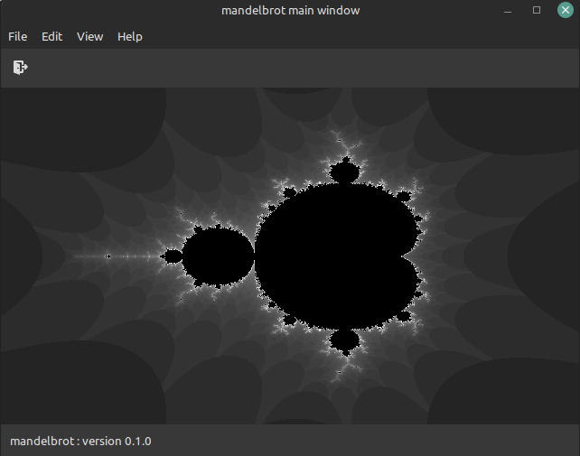

## MANDELBROT

Exploring the Mandelbrot set in GTK and Go.

Keys:
* Move : Arrow keys
* Zoom : Page Up/Down
* Reset : r
* Quit : q

# LINKS

Inspiration from The Coding Train : https://www.youtube.com/watch?v=6z7GQewK-Ks

# TODO

* Coloration
* Keys for :
  * Increase/decrease maxIteration
  * Increase/decrease infinity?